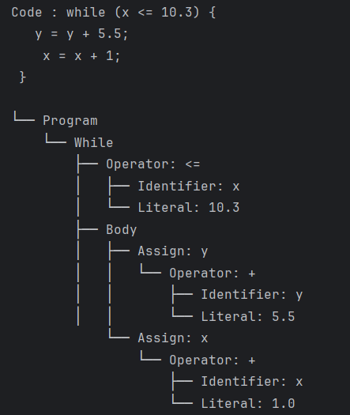
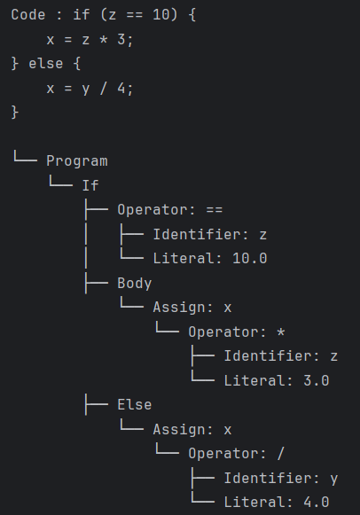
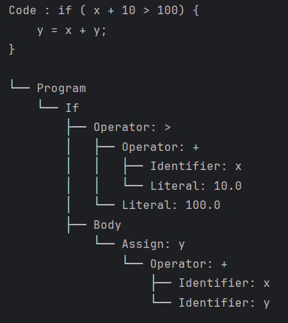

# Topic: Parser & Building an Abstract Syntax Tree

### Course: Formal Languages & Finite Automata
### Author: Daniela Cojocari

----
## Objectives:

* Get familiar with parsing, what it is and how it can be programmed.
* Get familiar with the concept of AST.
* In addition to what has been done in the 3rd lab work do the following:
  * In case you didn't have a type that denotes the possible types of tokens you need to:
    * Have a type TokenType (like an enum) that can be used in the lexical analysis to categorize the tokens.
    * Please use regular expressions to identify the type of the token.
  * Implement the necessary data structures for an AST that could be used for the text you have processed in the 3rd lab work.
  * Implement a simple parser program that could extract the syntactic information from the input text.
## Implementation description

* The implementation involves building a lexical analyzer that uses regular expressions to tokenize the input text 
based on defined `TokenType` categories such as identifiers, numbers, operators, and punctuation. A `Token` structure 
stores each token’s type and value. An Abstract Syntax Tree (AST) is constructed using node types like `AssignmentNode`,
`BinaryOperationNode`, `NumberNode`, and `IdentifierNode`, each representing a syntactic construct. A recursive descent
parser processes the token list, respects operator precedence, and builds the AST accordingly. This setup enables the 
extraction of syntactic structure from the input, supporting further analysis or interpretation.


### Lexer

* The TokenType class is an enumeration that defines all the possible types of tokens that can appear in your source 
code, such as numbers, identifiers, arithmetic operators, comparison operators, parentheses, braces, semicolons, and 
keywords like if, else, while, and return. Each token type is assigned automatically using the auto() function from the 
enum module, which helps you avoid manually specifying numeric values for each type.
```
class TokenType(Enum):
    NUMBER = auto()
    IDENTIFIER = auto()
    AND = auto()
    OR = auto()
    EQUALS = auto()
    GREATER_EQUAL = auto()
    LESS_EQUAL = auto()
    GREATER_THAN = auto()
    LESS_THAN = auto()
    PLUS = auto()
    MINUS = auto()
    MULTIPLY = auto()
    DIVIDE = auto()
    ASSIGN = auto()
    LPAREN = auto()
    RPAREN = auto()
    LBRACE = auto()
    RBRACE = auto()
    SEMICOLON = auto()
    KEYWORD = auto()

```

* The dictionary called TOKEN_REGEX maps each TokenType to a corresponding regular expression. These regular expressions 
describe how each token should look in the source code. For example, the regular expression for a number allows for both 
integers and decimal numbers, while the regular expression for an identifier ensures that it starts with a letter or 
underscore and is followed by letters, digits, or underscores. Operators like +, -, *, /, ==, and && also have their 
own patterns, as do punctuation marks and keywords.
```
TOKEN_REGEX = {
    TokenType.NUMBER: r'\d+(\.\d+)?',
    TokenType.IDENTIFIER: r'[a-zA-Z_][a-zA-Z0-9_]*',
    TokenType.AND: r'&&',
    TokenType.OR: r'\|\|',
    TokenType.EQUALS: r'==',
    TokenType.GREATER_EQUAL: r'>=',
    TokenType.LESS_EQUAL: r'<=',
    TokenType.GREATER_THAN: r'>',
    TokenType.LESS_THAN: r'<',
    TokenType.PLUS: r'\+',
    TokenType.MINUS: r'-',
    TokenType.MULTIPLY: r'\*',
    TokenType.DIVIDE: r'/',
    TokenType.ASSIGN: r'=',
    TokenType.LPAREN: r'\(',
    TokenType.RPAREN: r'\)',
    TokenType.LBRACE: r'\{',
    TokenType.RBRACE: r'\}',
    TokenType.SEMICOLON: r';',
    TokenType.KEYWORD: r'\b(if|else|while|return)\b'
}
```

* To efficiently scan the input code, the token_regex variable is constructed by joining all the individual token 
patterns into a single regular expression, where each pattern is wrapped in a named group. This allows the lexer to 
later identify which specific token type matched a given part of the input.
```
token_regex = '|'.join(f'(?P<{tok.name}>{pattern})' for tok, pattern in TOKEN_REGEX.items())
```

* he lexer function itself takes a string of code and returns a list of tokens. It does this by using the re.finditer()
function to apply the combined regular expression to the input code. For each match, the function retrieves the name of 
the matched group and the matched value. If the token is identified as an IDENTIFIER, but the value is one of the known 
keywords, it is manually reclassified as a KEYWORD to ensure correct parsing later. Each token is then stored as a tuple 
consisting of its TokenType and its corresponding string value. Finally, the function returns the complete list of 
these token tuples.
```
def lexer(code):
    tokens = []
    for match in re.finditer(token_regex, code):
        token_type = match.lastgroup
        value = match.group(token_type)
        # Identifier or keyword
        if token_type == 'IDENTIFIER' and value in ['if', 'else', 'while', 'return']:
            token_type = 'KEYWORD'
        tokens.append((TokenType[token_type], value))
    return tokens
```

### Parser
The Parser class is responsible for transforming a list of tokens (produced by the lexer) into an abstract syntax tree
(AST). This structure represents the hierarchical, nested nature of the source code's meaning.

* The constructor __init__ takes a list of tokens and initializes the pos variable to 0. This variable tracks the current
position in the token list as the parser processes them.
```
class Parser:
    def __init__(self, tokens):
        self.tokens = tokens
        self.pos = 0
```

* The current method returns the current token tuple (type and value) at the current position, or (None, None) if there 
are no more tokens to process. This method is essential for lookahead without consuming tokens.
```
    def current(self):
        return self.tokens[self.pos] if self.pos < len(self.tokens) else (None, None)
```

* The eat method consumes the current token only if it matches the expected token_type. It returns the token’s value and
advances the position. If the expected token is not found, it raises a SyntaxError, which helps in error reporting 
during parsing.
```
    def eat(self, token_type):
        if self.current()[0] == token_type:
            value = self.current()[1]
            self.pos += 1
            return value
        raise SyntaxError(f"Expected {token_type}, got {self.current()}")
```

* The parse method is the entry point of the parser. It loops through the token list and repeatedly calls 
parse_statement until all tokens are consumed, collecting each parsed statement into a list. It then wraps them in a 
Program node, which represents the whole parsed program.
```
    def parse(self):
        statements = []
        while self.current()[0] is not None:
            statements.append(self.parse_statement())
        return Program(statements)
```

* The parse_statement method distinguishes between different types of statements based on the current token. It checks 
if the current token is a while or if keyword, in which case it delegates to the appropriate specialized parser method. 
If not, it assumes the statement is an assignment.
```
    def parse_statement(self):
        if self.current()[0] == TokenType.KEYWORD and self.current()[1] == 'while':
            return self.parse_while()
        elif self.current()[0] == TokenType.KEYWORD and self.current()[1] == 'if':
            return self.parse_if()
        else:
            return self.parse_assignment()
```

* The parse_while method parses a while loop. It expects a while keyword, followed by a parenthesized condition 
expression and a block of statements enclosed in braces. The condition is parsed with parse_expression, and the body is 
parsed recursively using parse_statement. The result is a WhileStatement node.
```
    def parse_while(self):
        self.eat(TokenType.KEYWORD)  # while
        self.eat(TokenType.LPAREN)
        condition = self.parse_expression()
        self.eat(TokenType.RPAREN)
        self.eat(TokenType.LBRACE)
        body = []
        while self.current()[0] != TokenType.RBRACE:
            body.append(self.parse_statement())
        self.eat(TokenType.RBRACE)
        return WhileStatement(condition, body)
```

* The parse_if method handles if statements. Like parse_while, it expects a condition in parentheses and a body in 
braces. It also checks for an optional else block and parses that if present. It returns an IfStatement node that 
includes both the if body and the optional else body.
```
    def parse_if(self):
        self.eat(TokenType.KEYWORD)  # if
        self.eat(TokenType.LPAREN)
        condition = self.parse_expression()
        self.eat(TokenType.RPAREN)
        self.eat(TokenType.LBRACE)
        body = []
        while self.current()[0] != TokenType.RBRACE:
            body.append(self.parse_statement())
        self.eat(TokenType.RBRACE)

        else_body = None
        if self.current()[0] == TokenType.KEYWORD and self.current()[1] == 'else':
            self.eat(TokenType.KEYWORD)  # else
            self.eat(TokenType.LBRACE)
            else_body = []
            while self.current()[0] != TokenType.RBRACE:
                else_body.append(self.parse_statement())
            self.eat(TokenType.RBRACE)

        return IfStatement(condition, body, else_body)
```

* The parse_assignment method parses assignment statements, which consist of an identifier, an equals sign, an 
expression, and a semicolon. It returns an Assignment node with an Identifier and the parsed expression.
```
    def parse_assignment(self):
        identifier = self.eat(TokenType.IDENTIFIER)
        self.eat(TokenType.ASSIGN)
        expr = self.parse_expression()
        self.eat(TokenType.SEMICOLON)
        return Assignment(Identifier(identifier), expr)
```

* The expression parsing logic uses recursive descent with precedence. It breaks down expression parsing into several 
methods, each handling a different precedence level:
  * parse_expression is the top-level entry for expressions. It starts by parsing equality expressions. 
  * parse_equality handles == operations, using parse_comparison for sub-expressions. It supports left-associativity 
  by chaining binary expressions. 
  * parse_comparison handles relational operators (<, <=, >, >=) and calls parse_term for the operands. 
  * parse_term handles addition and subtraction, using parse_factor for sub-expressions. 
  * parse_factor handles multiplication and division, using parse_atom for the most basic elements. 
  * parse_atom deals with literals (numbers), identifiers (variables), and parenthesized expressions. If the token is 
  a number, it creates a Literal node; if it's an identifier, it creates an Identifier node; if it's a left parenthesis,
  it recursively parses a nested expression. If none match, it raises a SyntaxError.
```
    def parse_expression(self):
        return self.parse_equality()

    def parse_equality(self):
        left = self.parse_comparison()
        while self.current()[0] == TokenType.EQUALS:
            op = self.eat(TokenType.EQUALS)
            right = self.parse_comparison()
            left = BinaryExpression(left, op, right)
        return left

    def parse_comparison(self):
        left = self.parse_term()
        while self.current()[0] in {
            TokenType.LESS_THAN, TokenType.LESS_EQUAL,
            TokenType.GREATER_THAN, TokenType.GREATER_EQUAL
        }:
            op = self.eat(self.current()[0])
            right = self.parse_term()
            left = BinaryExpression(left, op, right)
        return left

    def parse_term(self):
        left = self.parse_factor()
        while self.current()[0] in {TokenType.PLUS, TokenType.MINUS}:
            op = self.eat(self.current()[0])
            right = self.parse_factor()
            left = BinaryExpression(left, op, right)
        return left

    def parse_factor(self):
        left = self.parse_atom()
        while self.current()[0] in {TokenType.MULTIPLY, TokenType.DIVIDE}:
            op = self.eat(self.current()[0])
            right = self.parse_atom()
            left = BinaryExpression(left, op, right)
        return left

    def parse_atom(self):
        tok_type, value = self.current()
        if tok_type == TokenType.NUMBER:
            self.eat(TokenType.NUMBER)
            return Literal(float(value))
        elif tok_type == TokenType.IDENTIFIER:
            self.eat(TokenType.IDENTIFIER)
            return Identifier(value)
        elif tok_type == TokenType.LPAREN:
            self.eat(TokenType.LPAREN)
            expr = self.parse_expression()
            self.eat(TokenType.RPAREN)
            return expr
        raise SyntaxError("Unexpected token in expression")

```

### AST
The ASTNode class serves as a base class for all AST nodes. It's essentially a placeholder that all specific node 
types will inherit from. This class itself does not contain any functionality but provides a structure for other node 
types.

* The Program class is a subclass of ASTNode and represents the overall program structure. It holds a list of statements,
which can include assignments, conditionals, loops, etc. It is initialized with a list of statements and has a __repr__ 
method that gives a string representation of the program, displaying its contained statements.
```
class ASTNode: pass

class Program(ASTNode):
    def __init__(self, statements):
        self.statements = statements
    def __repr__(self):
        return f"Program({self.statements})"

```

* The WhileStatement class is another subclass of ASTNode. It represents a while loop and contains two important parts: 
the loop’s condition and its body. The condition is an expression that is evaluated, and the body is a list of statements 
that are executed repeatedly as long as the condition remains true. The class has an initializer that sets the condition 
and body, and the __repr__ method provides a string representation of the while statement.
```
class WhileStatement(ASTNode):
    def __init__(self, condition, body):
        self.condition = condition
        self.body = body
    def __repr__(self):
        return f"While({self.condition}, {self.body})"
```

* The IfStatement class is a subclass of ASTNode that represents an if statement, including an optional else body. It 
contains the condition for the if check, the body of the if statement, and the body for the else clause, if it exists. 
The class includes an initializer to set these components, and the __repr__ method gives a string representation of the 
conditional structure.
```
class IfStatement(ASTNode):
    def __init__(self, condition, body, else_body=None):
        self.condition = condition
        self.body = body
        self.else_body = else_body
    def __repr__(self):
        return f"If({self.condition}, {self.body}, {self.else_body})"
```

* The Assignment class represents an assignment statement, like x = 5 + y;. It has two main components: the identifier 
and the expression being evaluated and assigned to the variable. The class's __repr__ method provides a string that
represents the assignment operation in a human-readable format.
```
class Assignment(ASTNode):
    def __init__(self, identifier, expression):
        self.identifier = identifier
        self.expression = expression
    def __repr__(self):
        return f"{self.identifier} = {self.expression}"
```

* The BinaryExpression class represents a binary operation between two expressions, such as arithmetic operations
or comparisons. It holds the left and right operands of the operation and the operator itself. The __repr__ method of
this class generates a string representation of the binary operation, showing the left operand, the operator, and the 
right operand.
```
class BinaryExpression(ASTNode):
    def __init__(self, left, operator, right):
        self.left = left
        self.operator = operator
        self.right = right
    def __repr__(self):
        return f"({self.left} {self.operator} {self.right})"
```

* The Literal class represents a literal value, such as a number. And the __repr__ method returns that value as a string.
```
class Literal(ASTNode):
    def __init__(self, value):
        self.value = value
    def __repr__(self):
        return str(self.value)
```

* The Identifier class represents a variable or identifier in the code. It contains the name of the variable 
and has a __repr__ method that simply returns the name of the identifier.
```
class Identifier(ASTNode):
    def __init__(self, name):
        self.name = name
    def __repr__(self):
        return self.name
```

* In order to test the functionality of the parser and the AST tree, I tested the code on three examples.




## Conclusions
In this lab work, I implemented a parser and an abstract syntax tree (AST) generator for a simple programming language. 
I started by redesigning the lexer from lab 3 that used regular expressions to convert the input source code into a 
sequence of tokens.
These tokens were then parsed using a recursive descent parser that handled different language constructs such as 
assignments, conditional statements, and loops. Additionally, I structured the parsed data into a tree of nodes that 
forms the AST, allowing for clear and organized representation of the code’s syntax. This exercise deepened my 
understanding of how compilers analyze and interpret code and provided practical experience with essential parsing 
techniques.