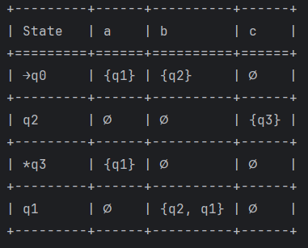

# Topic: Determinism in Finite Automata. Conversion from NDFA 2 DFA. Chomsky Hierarchy.

### Course: Formal Languages & Finite Automata
### Author: Daniela Cojocari

----
## Objectives:

* Understand what an automaton is and what it can be used for.
* Continuing the work in the same repository and the same project, the following need to be added:  
  * Provide a function in your grammar type/class that could classify the grammar based on Chomsky hierarchy.
* According to your variant number (by universal convention it is register ID), get the finite automaton definition and do the following tasks:
  * Implement conversion of a finite automaton to a regular grammar.
  * Determine whether your FA is deterministic or non-deterministic.
  * Implement some functionality that would convert an NDFA to a DFA.
  * Represent the finite automaton graphically


## Implementation description

* To classify a grammar based on the Chomsky hierarchy, I first declared type1, type2, and type3 as True, modifying 
their values as necessary throughout the function. To determine the classification, I extracted the left and right sides
of the productions and applied several checks. If the left side's length was greater than 1 or contained terminal 
symbols, the grammar could not be type 2 or type 3. If the left side was longer than the right side, it could not be 
type 1. Finally, to verify whether the grammar was type 3, I checked if the right-hand side followed a left-linear or 
right-linear pattern using regular expressions. If both left-linear and right-linear rules were present, the grammar 
could not be type 3. Then, I returned the type beginning with the most restricted one and finishing with type 0 which 
has no restrictions. 
* To prove that this function is working, I tested it using unit test.
```
    def chomskyHierarchy(self):
        type1 = True
        type2 = True
        type3 = True

        for leftSide, rightSide in self.P.items():
            leftLinear = False
            rightLinear = False

            if len(leftSide) > 1 or leftSide in self.VT:
                type2 = False
                type3 = False
            elif len(leftSide) > len(rightSide):
                type1 = False

            for term in rightSide:
                if re.match(r'^[a-z][A-Z]?$', term):
                    leftLinear = True
                elif re.match(r'^[A-Z]?[a-z]$', term):
                    rightLinear = True
                else:
                    type3 = False

                if leftLinear and rightLinear:
                    type3 = False

        if type3:
            return 3
        if type2:
            return 2
        if type1:
            return 1
        else:
            return 0
```

* To convert a finite automaton into a grammar, I defined a function within the FiniteAutomata class. This function 
initializes a Grammar instance using the finite automaton's variables.
```
class FiniteAutomata:
    def convertToGrammar(self):
        grammar = Grammar(self.Q, self.Sigma, self.delta, self.q0, self.F)
        return grammar
```

* In the Grammar class, I implemented a function to transform the transition function (delta) into grammar productions 
(P). To achieve this, I iterated over each non-terminal, terminal, and state in delta, appending the results accordingly. For final states, I added an empty string to represent the end of derivation.

```
class Grammar:
    def __init__(self, Q, Sigma, delta, q0, F):
        self.Vn = Q
        self.Vt = Sigma
        self.S = q0
        self.P = self.computeProductions(delta, F)

    def computeProductions(self, delta, F):
        prod = {}

        for (nonTerminal, terminal), state in delta.items():
            if nonTerminal not in prod:
                prod[nonTerminal] = []
            rule = [terminal + s for s in state]
            prod[nonTerminal].append(rule)

        for finalState in F:
            if finalState not in prod:
                prod[finalState] = []
            prod[finalState].append("")

        return prod

```

* To determine whether the Finite Automata is deterministic or non-deterministic, I checked if any transition in delta 
maps a state and input symbol to multiple states. If such a case exists, the automaton is non-deterministic; 
otherwise, it is deterministic.

```
    def typeFA(self):
        for operation, states in self.delta.items():
            if (len(states)) > 1:
                return False  # non-deterministic
        return True  # deterministic

```


* To convert an NFA into an DFA, I implemented the NFA_to_DFA function using subset construction, ensuring that each 
DFA state represents a set of NFA states. Firstly, I initialized an empty dictionary dfa to store the DFA transitions 
and a queue to keep track of unprocessed states. The queue starts with the initial state of the NFA, wrapped inside a 
list. The DFA’s first state is then added to dfa, using a tuple. The function processes states in a while loop until all
reachable states have been handled. In each iteration, the current DFA state (a set of NFA states) is dequeued and 
processed. For each input symbol in Sigma, I determined the reachable NFA states by iterating over the states in 
current, checking delta for valid transitions. If the new state is non-empty and hasn’t been recorded in dfa, it is 
added to both the queue and dfa. The transition is then stored in the DFA’s transition table. Finally, when all states
are processed, the function returns dfa, containing the DFA equivalent of the given NFA.

```
    def NFA_to_DFA(self):
        dfa = {}
        queue = []
        start_state = [self.q0]
        queue.append(start_state)
        dfa[tuple(start_state)] = {}

        while queue:
            current = queue.pop(0)
            for terminal in self.Sigma:
                new_state = []
                for state in current:
                    if (state, terminal) in self.delta:
                        for s in self.delta[(state, terminal)]:
                            if s not in new_state:
                                new_state.append(s)

                if new_state and tuple(new_state) not in dfa:
                    queue.append(new_state)
                    dfa[tuple(new_state)] = {}

                if new_state:
                    dfa[tuple(current)][terminal] = tuple(new_state)

        return dfa

```

* To graphically represent the Finite Automata I used the tabulate library, in which I indicated the states, terminals 
and the transitions. If there were no transitions, I used the void symbol.

```
    def faTable(self):
        table = []
        headers = ["State"] + list(self.Sigma)

        for state in self.Q:
            row = []

            if state == self.q0:
                row.append(f"→{state}")
            elif state in self.F:
                row.append(f"*{state}")
            else:
                row.append(state)

            for symbol in self.Sigma:
                transition = self.delta.get((state, symbol), [])
                row.append(f"{{{', '.join(transition)}}}" if transition else "∅")

            table.append(row)
        print(tabulate(table, headers, tablefmt="grid"))
```

* Moreover, to visualize better the NFA,  I constructed a table with the states and terminals, showing their respective transitions.




## Conclusions 
In this laboratory, I explored key concepts of finite automata, including conversion, classification, and graphical 
representation. 

Firstly, I implemented a function to classify grammars based on the Chomsky hierarchy, ensuring it could differentiate 
between types 0, 1, 2, and 3 grammars. Then, the finite automaton was successfully converted to a regular grammar,
and I verified its determinism by checking for multiple transitions from a single state. I also implemented a function 
to convert a non-deterministic finite automaton into a deterministic finite automaton using subset construction. 
Lastly, the finite automaton was represented graphically using the tabulate library, allowing for a clear visual 
presentation of states, transitions, and terminals.

In conclusion, this laboratory enhanced my understanding of the relationship between automata, grammars, and their classifications in the Chomsky hierarchy.